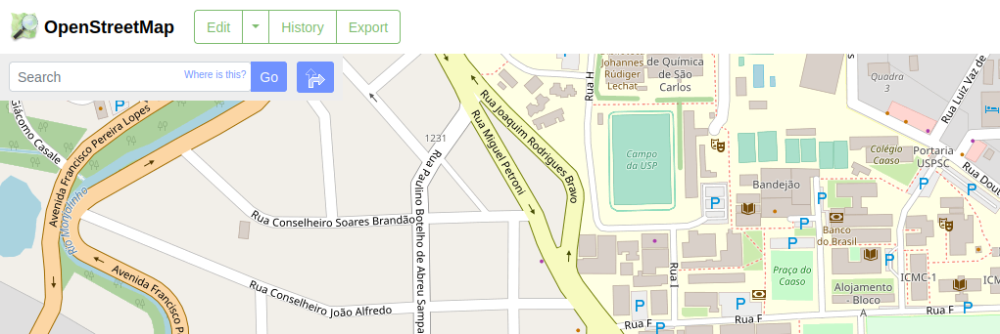
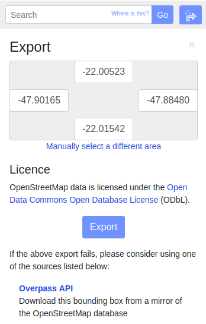
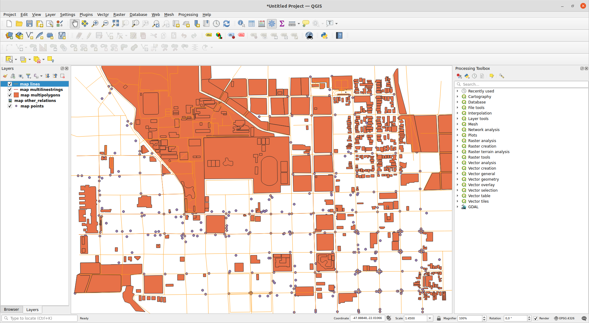
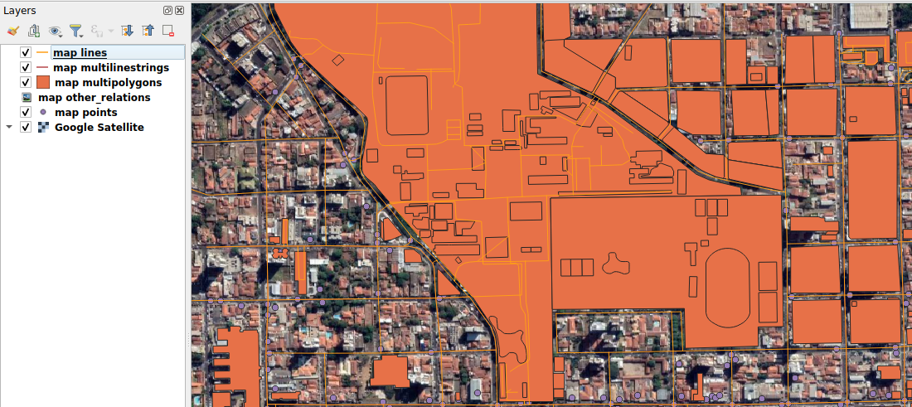
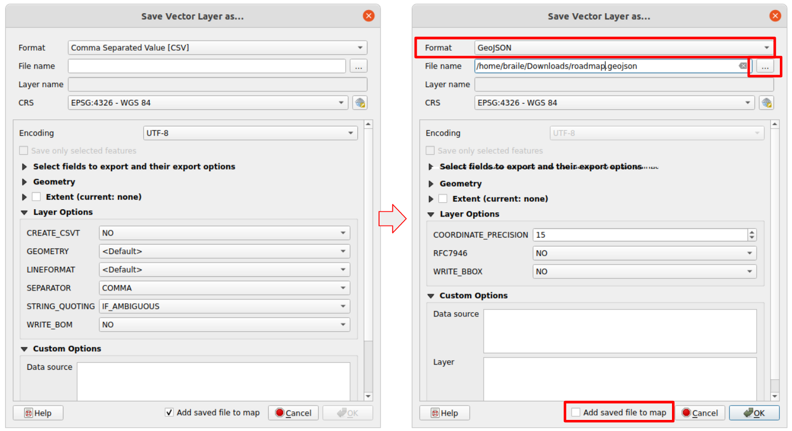

**This README is still under progress.**

Mapless Monte-Carlo Localization
=============


Tired of having to remap your city streets in 3D for running your autonomous-driving experiments? HD maps are too expensive for your team? This might be a project for you!

This repository contains the implementation of the Mapless Monte-Carlo Localization (or MMCL for short), in which no prior mapping step using an expensive sensor suite is required for localization. In fact, the maps used in this project can be downloaded using the [OpenStreetMap](https://www.openstreetmap.org/) database.

For more details on the method, check out our [paper](resources/paper.pdf), which was submitted to the IV2022 conference and still under review process.

Setup
=============

Ubuntu
-------

If you intend on running this project in a docker container, skip to the docker section. On the other hand, you can still peek the dockerfiles (under `./docker`) for guidance on the setup.

**GPU**
- Unfortunately, this project **REQUIRES** GPU for running the YOLO detection. Make sure you have the NVIDIA drivers installed and CUDA. We used the `cudatoolkit=11.3` in our tests.

**ROS**
- Install ROS1 in your machine - we recommend installing the [Noetic](http://wiki.ros.org/noetic/Installation/Ubuntu) version.

**Python 3** 
- Make sure you have `python>=3.7` for running this project. 
- Python 2 is definitively out of question in this project.

**Prepare your catkin workspace**
- `cd` to the directory from which you will use as a catkin workspace.
- Create the `src` directory using `mkdir src`

`darknet_ros`
- **Inside your carkin workspace's 'src':** Clone their repository recursively (`git clone --recursive https://github.com/leggedrobotics/darknet_ros`).

`mapless_mcl_ros`
- **Inside your carkin workspace's 'src':** Clone this repository recursively (`git clone --recursive https://github.com/cabraile/Mapless-MCL-ROS`)
- **Install the Python dependency** `mapless_mcl`: `cd <path_to_catkin_ws>/src/Mapless-MCL-ROS/mapless_mcl_py; pip install -e .`

**Optional (for running the demonstrations)**
- Download the `split_rectify_stereo` package [here](https://drive.google.com/file/d/1cig26bATuz5g-EIiUT-YCdjLovWB4RuB/view?usp=sharing).
- Move the downloaded directory to `<path_to_catkin_ws>/src`
- Download the ROS bag files [here](https://drive.google.com/drive/folders/19K-1EjE-EJwqM4iHRPnX-oLn--NlU0lt?usp=sharing);
- Download the road map file [here](https://drive.google.com/file/d/1BPNlTLTExGXqM3NVAV280eHUFdWGb9p0/view?usp=sharing);
- Download the trajectory file [here](https://drive.google.com/file/d/12sEUPd4Ntv2hiyNpk6SLxLV2rPuJuXH6/view?usp=sharing);

**Build**
- This part might take longer, but I promisse it will worth it
- In your catkin workspace, run 
    * If using [Catkin Tools](https://catkin-tools.readthedocs.io/en/latest/installing.html): `catkin init; catkin build -DCMAKE_BUILD_TYPE=Release`
    * Else: `catkin_make -DCMAKE_BUILD_TYPE=Release`
- `source devel/setup.bash`
- ... And you are good to go!

Docker (under progress)
-------
We prepared dockerfiles for running this project's nodes in case you do not want to set your whole machine up.

One liner image build command:
```bash
python3 dockerfile_gen.py --build
```
Or, instead, if you want to include the demo files:
```bash
python3 dockerfile_gen.py --build --include_demo
```

When compiled, set a `.env` file with the variables `BAGS_DIR` (the directory to the bags) and `DATA_DIR` (the directory in which the map and trajectory are contained). For instance

```bash
BAGS_DIR=/home/developer/cool_dataset/bags
DATA_DIR=/home/developer/cool_dataset/trajectory
```

Finally, run `docker-compose up` and witness the magic! Of course, you have to run `rviz` first using the configuration file in `mapless_mcl_ros_demos/rviz/carina.rviz` for actually visualizing it.

Demos
=============

Carina 2
------------

How to use
=============
This approach requires the map to be downloaded and prepared (actually, split) before usage. Some knowledge in GIS will be useful here.

Downloading the map
-------------
In the [OpenStreetMap website](https://openstreetmap.org), move to a region that is interesting for your application. Make all of the region of interest inside the visualuzation and click in the `Export` button.



A menu will open on the left side. Click at the `Overpass API` link and wait for your map to be downloaded.



Separating the road elements
-------------
The downloaded map contains data from many different elements. For this project, we are still using only the road network elements ~~, however keep tuned for updates!~~. We need, therefore, to split these elements.

One way to do so is to use a GIS software as ArcGIS or QGIS. The latter is a free option that works in Linux systems, so let's stick with it for this tutorial. The installation instructions can be found [here](https://www.qgis.org/en/site/forusers/alldownloads.html).

Open the QGIS software and drag the downloaded map to the user interface window. A window indicating that multiple layers exist will pop up. Click `Select All` and `Ok`. The map elements will be loaded and rendered in the main window.



Satellite images will become handy for this application. I would suggest accessing [this tutorial](https://opensourceoptions.com/blog/how-to-add-google-satellite-imagery-and-google-maps-to-qgis/) for enabling the Google Satellite imagery visualization in QGIS. If you include this layer and all the elements disapear, just drag the Satellite layer to the bottom in the left menu.



For exporting the road networks in a `geojson` format, right-click the `map lines` in the `Layers` menu, hover `Export` and click at `Save Features As...`. A new window will appear with a lot of options. Fill only the ones indicated in red and click `Ok`.



~~Preparing the trajectory (under progress)~~
-------------
Ideally, the trajectory should be provided by a path planning algorithm. However, our current implementation does not support ~~yet~~ trajectories provided by a ROS node. Instead, the trajectory is provided by another `geojson` file that can also be made using QGIS, so let's get our hands dirty and 'draw' the agent's trajectory in the map.


Setting up the launch files
-------------

Run
-------------

