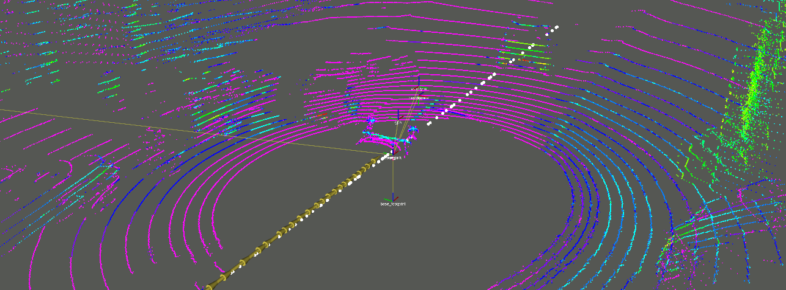

**This README is still under progress.**

Mapless Monte-Carlo Localization
=============



Tired of having to remap your city streets in 3D for running your autonomous-driving experiments? HD maps are too expensive for your team? This might be a project for you!

This repository contains the implementation of the Mapless Monte-Carlo Localization (or MMCL for short), in which no prior mapping step using an expensive sensor suite is required for localization. In fact, the maps used in this project can be downloaded using the [OpenStreetMap](https://www.openstreetmap.org/) database.

For more details on the method, check out our [paper](resources/paper.pdf), which was submitted to the IV2022 conference and **still under review process**.

Setup
=============

Ubuntu
-------

If you intend on running this project in a docker container, skip to the docker section. On the other hand, you can still peek the dockerfiles (under `./docker`) for guidance on the setup.

**GPU**
- Unfortunately, this project **REQUIRES** GPU for running the YOLO detection. Make sure you have the NVIDIA drivers installed and CUDA. We used the `cudatoolkit=11.3` in our tests.

**ROS**
- Install ROS1 in your machine - we recommend installing the [Noetic](http://wiki.ros.org/noetic/Installation/Ubuntu) version.

**Python 3** 
- Make sure you have `python>=3.7` for running this project. 
- Python 2 is definitively out of question in this project.

**Prepare your catkin workspace**
- `cd` to the directory from which you will use as a catkin workspace.
- Create the `src` directory using `mkdir src`

`darknet_ros`
- **Inside your carkin workspace's 'src':** Clone their repository recursively (`git clone --recursive https://github.com/leggedrobotics/darknet_ros`).

`mapless_mcl_ros`
- **Inside your carkin workspace's 'src':** Clone this repository recursively (`git clone --recursive https://github.com/cabraile/Mapless-MCL-ROS`)
- **Install the Python dependency** `mapless_mcl`: `cd <path_to_catkin_ws>/src/Mapless-MCL-ROS/mapless_mcl_py; pip install -e .`

**Optional (for running the demonstrations)**
- Download the `split_rectify_stereo` package [here](https://drive.google.com/file/d/1cig26bATuz5g-EIiUT-YCdjLovWB4RuB/view?usp=sharing).
- Move the downloaded directory to `<path_to_catkin_ws>/src`
- Download the ROS bag files [here](https://drive.google.com/drive/folders/19K-1EjE-EJwqM4iHRPnX-oLn--NlU0lt?usp=sharing);
- Download the road map file [here](https://drive.google.com/file/d/1BPNlTLTExGXqM3NVAV280eHUFdWGb9p0/view?usp=sharing);
- Download the trajectory file [here](https://drive.google.com/file/d/12sEUPd4Ntv2hiyNpk6SLxLV2rPuJuXH6/view?usp=sharing);

**Build**
- This part might take longer, but I promisse it will worth it
- In your catkin workspace, run 
    * If using [Catkin Tools](https://catkin-tools.readthedocs.io/en/latest/installing.html): `catkin init; catkin build -DCMAKE_BUILD_TYPE=Release`
    * Else: `catkin_make -DCMAKE_BUILD_TYPE=Release`
- `source devel/setup.bash`
- ... And you are good to go!

Docker (under progress)
-------
We prepared dockerfiles for running this project's nodes in case you do not want to set your whole machine up.

One liner image build command:
```bash
python3 dockerfile_gen.py --build
```
Or, instead, if you want to include the demo files:
```bash
python3 dockerfile_gen.py --build --include_demo
```

When compiled, set a `.env` file with the variables `BAGS_DIR` (the directory to the bags) and `DATA_DIR` (the directory in which the map and trajectory are contained). For instance

```bash
BAGS_DIR=/home/developer/cool_dataset/bags
DATA_DIR=/home/developer/cool_dataset/trajectory
```

Finally, run `docker-compose up` and witness the magic! Of course, you have to run `rviz` first using the configuration file in `mapless_mcl_ros_demos/rviz/carina.rviz` for actually visualizing it.

Demos
=============
Currently, only one demo is provided - which is the one used in our proposed paper. We aim to include demonstrations using the Ford AV dataset as well.

Carina 2
------------
For running the **Carina 2** demonstration, first edit the indicated parameters in the `mapless_mcl_ros_demos/launch/carina_demo.launch` file. 

Next, execute `roslaunch mapless_mcl_ros_demos carina_demo` in your favorite command line tool!

Preparing the map and the trajectories
=============
Preparing both the map and trajectory requires some knowledge in GIS and the usage of GIS tools. Therefore, we dedicated a detailed tutorial for preparing the maps [here](resources/gis_tutorial.md).

Setting up the launch files
=============
If you are including the `mapless_mcl_ros/launch/run.launch` file to your project, set the following variables in the parent launch file:
* `map_path`: The absolute path to the road map.
* `trajectory_path` : The absolute path to the trajectory file.
* `n_particles` : Sets the number of particles used by the filter.
* `odom_topic`: The topic that publishes `nav_msgs.Odometry` messages, will serve as input for this project's nodes;
* `model_sensitivity` (optional): The detection model's sensitivity. In case using the default Darknet ROS parameters, this value does not need to be changed.
* `model_false_positive_rate` (optional): The detection model's false positive rate. In case using the default Darknet ROS parameters, this value does not need to be changed.

Run
=============
One liner.

```bash
roslaunch mapless_mcl_ros run.launch
```
