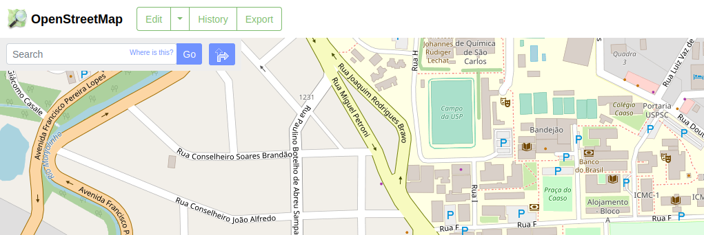
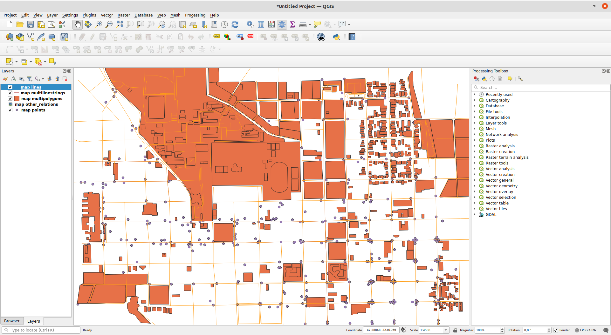
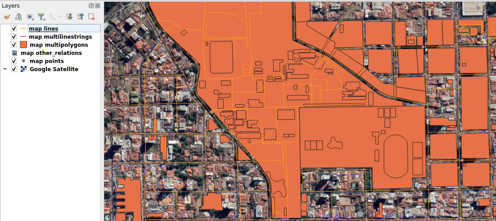

GIS Tutorial
============

Step 1: Downloading the map
-------------
In the [OpenStreetMap website](https://openstreetmap.org), move to a region that is interesting for your application. Make all of the region of interest inside the visualuzation and click in the `Export` button.

A menu will open on the left side. Click at the `Overpass API` link and wait for your map to be downloaded.

Step 2: Separating the road elements
-------------
The downloaded map contains data from many different elements. For this project, we are still using only the road network elements ~~, however keep tuned for updates!~~. We need, therefore, to split these elements.

One way to do so is to use a GIS software as ArcGIS or QGIS. The latter is a free option that works in Linux systems, so let's stick with it for this tutorial. The installation instructions can be found [here](https://www.qgis.org/en/site/forusers/alldownloads.html).

Open the QGIS software and drag the downloaded map to the user interface window. A window indicating that multiple layers exist will pop up. Click `Select All` and `Ok`. The map elements will be loaded and rendered in the main window.

Satellite images will become handy for this application. I would suggest accessing [this tutorial](https://opensourceoptions.com/blog/how-to-add-google-satellite-imagery-and-google-maps-to-qgis/) for enabling the Google Satellite imagery visualization in QGIS. If you include this layer and all the elements disapear, just drag the Satellite layer to the bottom in the left menu.

For exporting the road networks in a `geojson` format, right-click the `map lines` in the `Layers` menu, hover `Export` and click at `Save Features As...`. A new window will appear with a lot of options. Fill only the ones indicated in red and click `Ok`.

Step 3: Preparing the trajectory
-------------

### 3.1 Creating the `ESRI ShapeFile`
Ideally, the trajectory should be provided by a path planning algorithm. However, our current implementation does not support ~~yet~~ trajectories provided by a ROS node. Instead, the trajectory is provided by another `geojson` file that can also be made using QGIS, so let's get our hands dirty and 'draw' the agent's trajectory in the map.

A trajectory, in this project, is a sequence of [line strings](https://shapely.readthedocs.io/en/stable/manual.html#linestrings) indicating the sequence of way points which the agent has to follow. For creating the trajectory file, click in the `New shapefile Layer`. 

Fill the next window acoording to the illustration below.

* Fill it either with `LineString` or `MultiLineString` in the `Geometry type` field, the exported shapefile will store it as a `MultiLineString` either way.

After that, a new layer will be added to the left bar in the main window. 

### 3.2 Adding the attributes
We have to add the properties that each LineString from the trajectory will have. For that, double click in the new trajectory layer on the layers menu and select `Fields`.

Click on the pencil and next on the yellow star icon. A window for adding a field will be included.

Fill the fields according to the next images, click `ok` after filling each new field and `ok` for applying all the changes to the new layer.

### 3.3 Including the `LineString` elements
**Select the trajectory elements layer** then, in the toolbar on the top, click on the pencil (enable edition) and next in the yellow star for adding LineString points.

Use left-click on the map for adding points in the `LineString` and, in case you've misclicked while adding points to the layer, press `backspace` for removing them.

After the sequence of points for the part of the trajectory was added, right-click anywere to proceed to saving it. A window for filling that trajectory part will appear, then fill the fields so that:
* `seq_id` refers to the sequential index of the current part of the trajectory (starts at 0);
* `ref_osm_id` refers to the `id` of the OSM road from which this element belongs (will inherit its properties in the code). In case the points belong to a transition between two streets, any of the ids will be enough. We will explain later how to check the element ID using QGIS.
* `action` refers to the current action (`forward`, `turn left`, `turn_right`). This is currently not used, but will be used in the expansions of this project and aim to be used when curves are triggered.
* Any other field can be `NULL` since they are not used in our project.

Each part of the trajectory can be inserted this way and the last point of one part should be very close to the first point of the next part. By close we mean distances $<1cm$.

Finally, after adding all the lines to the trajectory, save by clicking the save icon on the toolbar and click again on the `Enable edition` button for disableing it.

**We still did not test loading `ESRI Shapefile` trajectory files** in our experiments. Therefore, we recommend an additional step, which is to export the layer as a `GeoJSON` formatted file. Right-click the trajectory layer, hover `Export` and select `Save Features As...`. Fill it according to the image below.

Congratulations: The exported file is your trajectory and it is good to go!

# Hints

## If you accidentely added a LineString to the map, 
**You should not remove it by pressing `Delete`**! Instead, follow the instructions below:

## For checking the OSM id of an adjacent linestring

